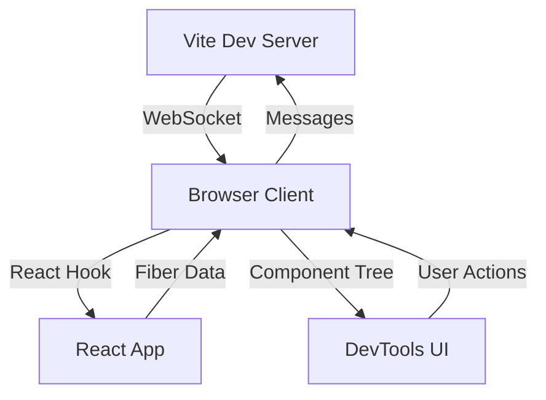

# Development Guide

This guide will help you set up the development environment and understand the codebase structure.

## 🏗️ Project Structure

```
vite-plugin-react-devtools/
├── src/
│   ├── index.ts          # Main plugin entry point
│   ├── types.ts          # TypeScript type definitions
│   ├── react-detector.ts # React component detection utilities
│   └── ui.ts            # DevTools UI components
├── example/             # Example React app for testing
│   ├── src/
│   │   ├── App.tsx      # Demo React components
│   │   └── main.tsx     # App entry point
│   ├── vite.config.ts   # Vite config with plugin
│   └── package.json     # Example dependencies
├── test/               # Test files
├── TODO.md            # Feature roadmap and tasks
├── README.md          # Usage documentation
└── package.json       # Plugin dependencies
```

## 🚀 Getting Started

### Prerequisites

- Node.js 18+
- pnpm (recommended) or npm/yarn
- A React project for testing

### Setup Development Environment

1. **Clone the repository**
   ```bash
   git clone https://github.com/Sunny-117/vite-plugin-react-devtools.git
   cd vite-plugin-react-devtools
   ```

2. **Install dependencies**
   ```bash
   pnpm install
   ```

3. **Start development mode**
   ```bash
   pnpm dev
   ```

4. **Run the example app**
   ```bash
   cd example
   pnpm install
   pnpm dev
   ```

5. **Open the example app**
   - Navigate to `http://localhost:3000`
   - Click the ⚛️ button to open DevTools
   - Inspect the React components

## 🔧 Development Workflow

### Building the Plugin

```bash
# Build for production
pnpm build

# Build and watch for changes
pnpm dev
```

### Testing

```bash
# Run unit tests
pnpm test

# Run tests in watch mode
pnpm test --watch

# Run type checking
pnpm typecheck
```

### Linting

```bash
# Run ESLint
pnpm lint

# Fix linting issues
pnpm lint --fix
```

## 📁 Core Components

### 1. Main Plugin (`src/index.ts`)

The main Vite plugin that:
- Sets up WebSocket server for DevTools communication
- Injects client script into the browser
- Handles plugin lifecycle and configuration

Key functions:
- `reactDevTools()` - Main plugin factory
- `setupWebSocketServer()` - Creates WebSocket server
- `generateClientScript()` - Generates browser client code

### 2. Type Definitions (`src/types.ts`)

Comprehensive TypeScript types for:
- React component representation
- DevTools messages and communication
- Plugin configuration options
- React Fiber integration

### 3. React Detection (`src/react-detector.ts`)

Utilities for detecting and parsing React components:
- `getReactDevToolsHook()` - Access React's internal hook
- `fiberToComponent()` - Convert Fiber nodes to our format
- `getComponentTree()` - Extract component hierarchy
- `setupReactIntegration()` - Hook into React's lifecycle

### 4. UI Components (`src/ui.ts`)

DevTools user interface:
- `createDevToolsUI()` - Main DevTools panel
- `renderComponentTree()` - Component tree visualization
- `updatePropsInspector()` - Props/state/hooks inspector
- `createToggleButton()` - Floating toggle button

## 🔄 Communication Flow



1. **Plugin Setup**: Vite plugin creates WebSocket server
2. **Client Injection**: Browser receives DevTools client script
3. **React Integration**: Client hooks into React's DevTools hook
4. **Data Flow**: Component data flows through WebSocket to UI
5. **User Interaction**: UI sends commands back to React app

## 🎯 Current Implementation Status

### ✅ Completed (Phase 1)
- [x] Basic Vite plugin structure
- [x] WebSocket communication
- [x] Component tree detection
- [x] Basic UI with toggle button
- [x] Props/state/hooks inspection UI
- [x] Example app for testing

### 🚧 In Progress
- [ ] Real React Fiber integration
- [ ] Component selection and highlighting
- [ ] Props/state editing
- [ ] Source code navigation

### 📋 Planned (Phase 2+)
- [ ] React Profiler integration
- [ ] Re-render tracking
- [ ] Time travel debugging
- [ ] Performance analysis

## 🐛 Debugging

### Common Issues

1. **WebSocket Connection Failed**
   - Check if port 8097 is available
   - Verify firewall settings
   - Try a different port in config

2. **React Not Detected**
   - Ensure React 16.8+ is installed
   - Check that React DevTools hook is available
   - Verify plugin is loaded after React

3. **Component Tree Empty**
   - Check browser console for errors
   - Verify React app is properly mounted
   - Ensure components are using hooks/state

### Debug Tools

```javascript
// In browser console
console.log(window.__REACT_DEVTOOLS_GLOBAL_HOOK__)
console.log(window.__REACT_DEVTOOLS__)
console.log(window.__REACT_DEVTOOLS_UI__)
```

## 🧪 Testing Strategy

### Unit Tests
- Plugin configuration and setup
- Message handling and WebSocket communication
- Component tree parsing utilities
- UI component rendering

### Integration Tests
- Full plugin workflow with example app
- WebSocket communication end-to-end
- React integration and component detection

### Manual Testing
- Use the example app to test features
- Test with different React patterns (hooks, classes, etc.)
- Verify cross-browser compatibility

## 📚 Resources

### React Internals
- [React Fiber Architecture](https://github.com/acdlite/react-fiber-architecture)
- [React DevTools Implementation](https://github.com/facebook/react/tree/main/packages/react-devtools)
- [React Reconciler](https://github.com/facebook/react/tree/main/packages/react-reconciler)

### Vite Plugin Development
- [Vite Plugin API](https://vitejs.dev/guide/api-plugin.html)
- [Plugin Development Guide](https://vitejs.dev/guide/plugin-development.html)
- [Rollup Plugin Conventions](https://rollupjs.org/guide/en/#plugin-development)

### WebSocket & Real-time Communication
- [WebSocket API](https://developer.mozilla.org/en-US/docs/Web/API/WebSocket)
- [ws Library Documentation](https://github.com/websockets/ws)

## 🤝 Contributing

1. **Fork the repository**
2. **Create a feature branch**: `git checkout -b feature/amazing-feature`
3. **Make your changes** and add tests
4. **Run the test suite**: `pnpm test`
5. **Commit your changes**: `git commit -m 'Add amazing feature'`
6. **Push to the branch**: `git push origin feature/amazing-feature`
7. **Open a Pull Request**

### Code Style

- Use TypeScript for all new code
- Follow the existing ESLint configuration
- Add JSDoc comments for public APIs
- Write tests for new functionality

### Commit Messages

Follow conventional commits:
- `feat:` new features
- `fix:` bug fixes
- `docs:` documentation changes
- `refactor:` code refactoring
- `test:` adding tests
- `chore:` maintenance tasks
